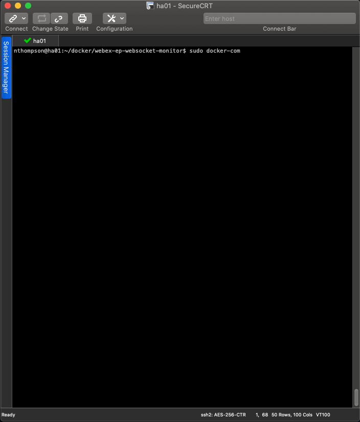
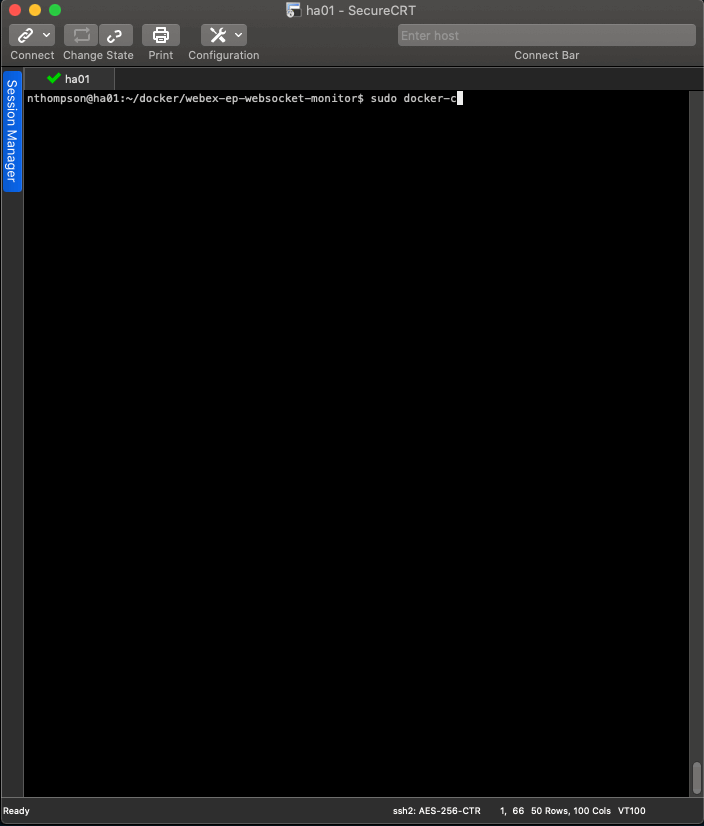
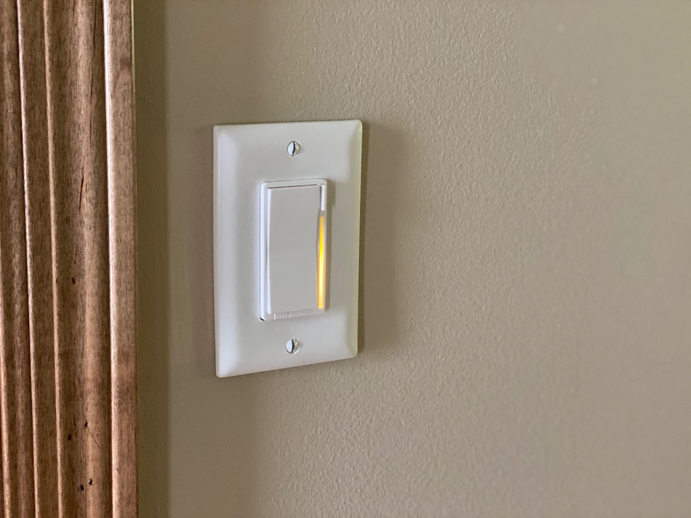
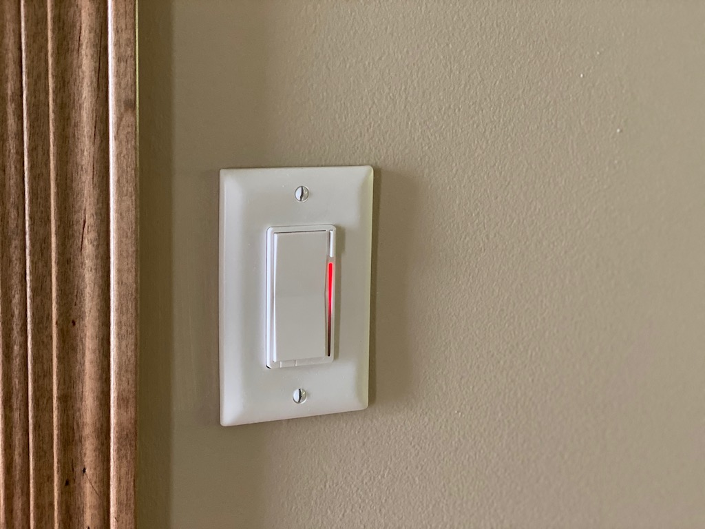

# Cisco Webex Endpoint xAPI Monitor

[](https://developer.cisco.com/codeexchange/github/repo/nsthompson/webex-ep-websocket-monitor)

## Abstract

With an increase in the number of people and families working from home at the same time, being able to alert your spouse, partner, or roommate(s) that you are on an audio or video call is becoming increasingly important.

To solve this challenge, this application leverages the xAPI available on Cisco Webex Endpoints, as well as the Home-Assistant (https://www.home-assistant.io) home automation platform to trigger notification alerts on Inovelli (https://inovelli.com/) Red-Series Z-Wave Dimmers.

This application connects to a Cisco Webex Endpoint via Websockets and subscribe to state events from the endpoint including:

* Active Calls
* Camera Lid Status

These state events are parsed and then trigger the LED notification strip on the Inovelli Red-Series Dimmers with the configured notification colors and pattern.

## Components

### websocket-monitor.py

Primary application to subscribe to events on the Cisco Webex endpoint and trigger notifications via Home-Assistant

### lib/notifications.py

Framework for triggering notifications.  Currently leveraging Home-Assistant, but if you are not a Home-Assistant user this is the code you would want to modify to trigger whatever end device you may be using.

### lib/plugins/ha.py

Mini-SDK for interacting with Home-Assistant via REST API.

### ENVEXAMPLE

Example .env file for configuring the application.

### Dockerfile

Dockerfile for building the container to run the application

### docker-compose.yml

Docker-Compose file for creating and running the container

## Requirements

* python 3.8
* Docker Compose (https://docs.docker.com/compose/)
* Docker Engine or Docker Desktop (https://www.docker.com/)
* Compatible Cisco WebEx Endpoint with API Access and Websockets Enabled
    * Can be on-premise or cloud registered
* Home-Assistant Home Automation Platform (https://www.home-assistant.io)
* Inovelli Red Series Dimmers (https://www.inovelli.com/)

## Cisco Webex Endpoint Requirements

1. If cloud registered, create a local-admin account on the endpoint for API access
   
   https://help.webex.com/en-us/jkhs20/Local-User-Administration-on-Room-and-Desk-Devices

2. Enable API and WebSockets
   
   https://www.cisco.com/c/dam/en/us/td/docs/telepresence/endpoint/ce912/collaboration-endpoint-software-api-reference-guide-ce912.pdf

## Getting Started

1. Clone This Repository

2. Copy ENVEXAMPLE to .env

    ```shell
    cp ENVEXAMPLE .env
    ```

3. Edit .env and fill out the appropriate values for your installation

    | Key | Description |
    | --- | --- |
    | EP_USERNAME | Cisco Webex Endpoint Username |
    | EP_PASSWORD | Cisco Webex Endpoint Password |
    | EP_ADDRESS | IP Address of Cisco Webex Endpoint |
    | HA_ADDRESS | Home-Assistant Hostname or IP Address |
    | HA_PORT | Home-Assistant TCP Port |
    | HA_API_KEY | Home-Assistant API Key |
    | HA_ZWAVE_NODE_ID | Home-Assistant ZWave Node ID - ID of Device you are triggering alerts on|
    | HA_ZWAVE_PARAMETER | ZWave Configuration Parameter - Should be 16 for Inovelli Switches |
    | HA_ZWAVE_SIZE | ZWave Size Parameter - Should be 4 for Inovelli Switches |
    | HA_ZWAVE_ON_VIDEO | Numeric Parameter Value for On Video Notificaton |
    | HA_ZWAVE_ON_CALL | Numeric Parameter Value for On Call Notificaton |
    | HA_ZWAVE_OFF | Numeric Parameter Value for turning off Notifications |

    Note: 
    To calculate the Numeric Parameters for ON_VIDEO, ON_CALL, and OFF see the following site:

    https://nathanfiscus.github.io/inovelli-notification-calc/

4. Build and start the container using docker-compose

    ```shell
    sudo docker-compose up -d --build
    ```

    

5. View the Container Logs if Necessary

    ```shell
    sudo docker-compose logs wsmonitor --tail all
    ```

    

## Active Notification Examples

* Audio Call (Value: 50268693)

    

* Video Call (Value: 50268927)

    

## Contributors

* Nick Thompson (@nsthompson)
